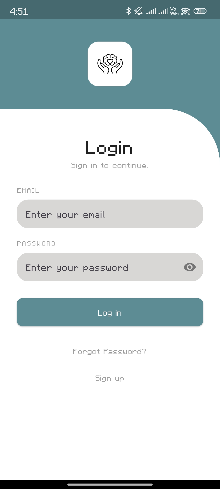
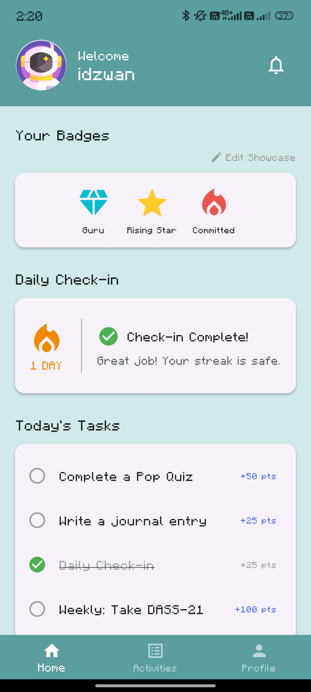
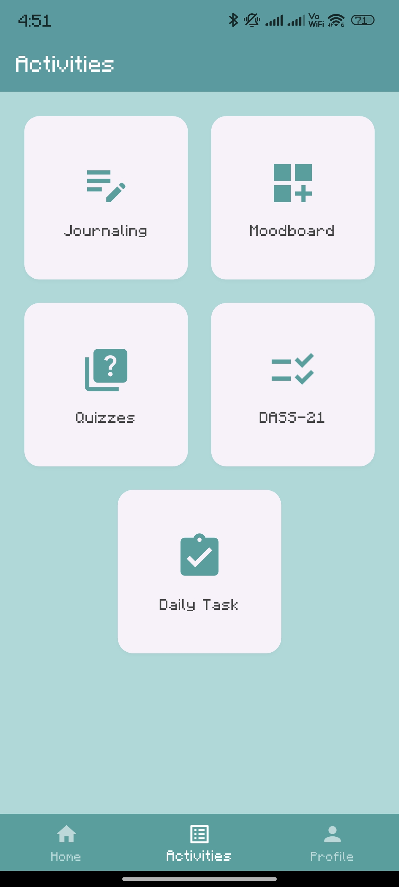
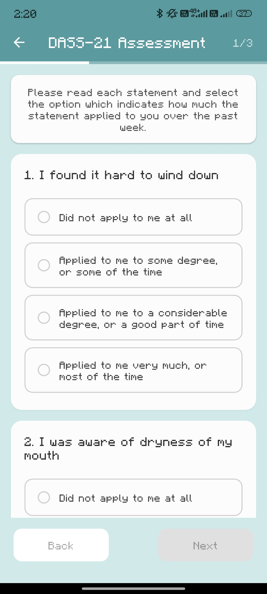
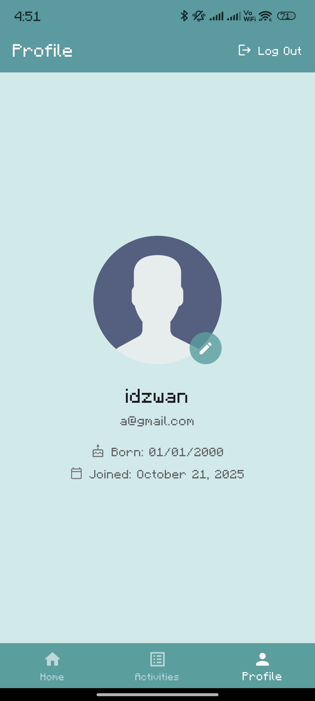

# Emoticore 💖

Emoticore is a gamified mobile mental health (mHealth) application built with Flutter and Firebase. This project is developed as part of a university course (`CSP`, Semester 6) to explore mobile app development for mental well-being. The app combines traditional tracking tools with gamification elements to encourage consistent engagement.

## 📸 Screenshots

*(You can add screenshots of your app here)*

| Login Page | Dashboard | Activities | DASS-21 Quiz | Profile |
| :---: | :---: | :---: | :---: | :---: |
|  |  |  |  |  |

## ✨ Features

### 🎮 Gamification System (New!)
* **Points & Leveling:** Users earn Experience Points (XP) for completing tasks, checking in, and taking quizzes. Users progress through 7 distinct levels (Novice to Guru) based on their total points.
* **Daily Streaks:** Tracks consecutive days of app usage to encourage habit building.
* **Achievement Badges:** Automatically awards badges for milestones (e.g., "Rising Star" for 100 pts, "Committed" for a 3-day streak).
* **Unlockable Avatars:** Users can unlock premium avatars (e.g., Astronaut, Robot, Animals) by earning points or reaching specific milestones.

### 🧠 Core Functionality
* **Firebase Authentication:** Full email & password sign-up, login, and "Forgot Password" functionality.
* **Dynamic Dashboard:**
    * Welcomes the user with their live data.
    * **Live DASS-21 Chart:** Displays Stress, Anxiety, and Depression scores in a bar chart (`fl_chart`).
    * **Daily Mood Tracker:** A "once-a-day" pop-up to track mood using emojis.
* **Activities Hub:**
    * **Pop Quiz:** A randomized 5-question mental health quiz fetched from the `quiz_bank`. Users receive instant feedback and earn points for correct answers (plus bonuses for perfect scores).
    * **Enhanced Journaling:** A masonry grid view of journal entries. Supports rich entries with **images** and text.
    * **Moodboards:** Users can create visual moodboards with titles, descriptions, and image collages displayed in a staggered grid.
    * **DASS-21 Assessment:** A standard 21-question assessment to calculate mental health scores.
* **Notification Center:**
    * In-app notifications alert users when they unlock badges, earn new avatars, or receive system messages.
* **Profile Tab:**
    * Displays User Level, Progress Bar to the next level, and Total Points.
    * **Avatar Selection System:** View and equip unlocked avatars.
    * Personalized "Mantra" display.

### 🎨 UI/UX & Animations
* **Animated Splash Screen:** Multi-stage launch sequence using `flutter_native_splash` and Lottie animations.
* **Staggered Grids:** Beautiful masonry layouts for Journal and Moodboard feeds using `flutter_staggered_grid_view`.
* **Custom Animations:** Smooth `FadeRoute` page transitions and Lottie animations for loading states, success screens, and trophies.

## 🚀 Tech Stack

* **Frontend:** Flutter & Dart
* **Backend:** Firebase
    * **Authentication:** User management.
    * **Cloud Firestore:** NoSQL database for users, journal entries, moodboards, quizzes, and notifications.
    * **Firebase Storage:** (Optional) For storing user-uploaded images.
* **Key Packages:**
    * `firebase_core`, `firebase_auth`, `cloud_firestore`
    * `lottie` (Animations)
    * `fl_chart` (Data visualization)
    * `flutter_staggered_grid_view` (Masonry layouts)
    * `cached_network_image` (Image caching)
    * `shared_preferences` (Local data persistence)
    * `intl` (Date formatting)
    * `flutter_native_splash` (Native splash screen)

## Firebase Setup 🔥

Before running the project, you **must** configure Firebase and populate the database:

1.  **Create Project:** Go to the [Firebase Console](https://console.firebase.google.com/).
2.  **Configure App:** Use `flutterfire configure` or manually add `google-services.json` (Android) and `GoogleService-Info.plist` (iOS).
3.  **Enable Services:**
    * **Authentication:** Email/Password.
    * **Firestore Database:** Create the database.
4.  **Populate Quiz Bank (Important):**
    * Create a collection named `quiz_bank`.
    * Add documents for each question with fields:
        * `question` (string)
        * `answers` (array of strings)
        * `correctIndex` (number, 0-based index)

## 🚦 Getting Started

1.  **Clone the Repository:**
    ```bash
    git clone [Your Repository URL]
    cd emoticore
    ```
2.  **Install Dependencies:**
    ```bash
    flutter pub get
    ```
3.  **Generate Splash Screen:**
    ```bash
    flutter pub run flutter_native_splash:create
    ```
4.  **Run the App:**
    ```bash
    flutter run
    ```

## 📂 Project Structure
```
lib/ 
├── assets/ # Local images and Lottie animations 
├── lib/ 
│ ├── main.dart 
│ ├── gamification_data.dart # Badges, Levels, and Avatar rules 
│ ├── gamification_service.dart # Logic for points and unlocking 
│ ├── notification_service.dart # In-app notification handling 
│ ├── streak_service.dart # Daily streak logic 
│ ├── dashboard_page.dart # Main Home Tab 
│ ├── activities_page.dart # Activities Grid 
│ ├── pop_quiz_page.dart # Quiz Game 
│ ├── quiz_results_page.dart # Quiz Scoring Screen 
│ ├── journaling_page.dart # Journal Feed 
│ ├── moodboard_page.dart # Moodboard Feed 
│ ├── moodboard_detail_page.dart# Moodboard View 
│ ├── notifications_page.dart # Notification Center 
│ ├── profile_page.dart # User Profile & Gamification Stats 
│ └── ... (Auth pages, etc.) 
└── pubspec.yaml
```